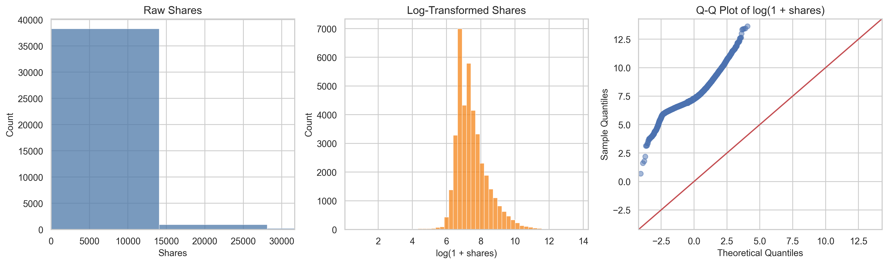
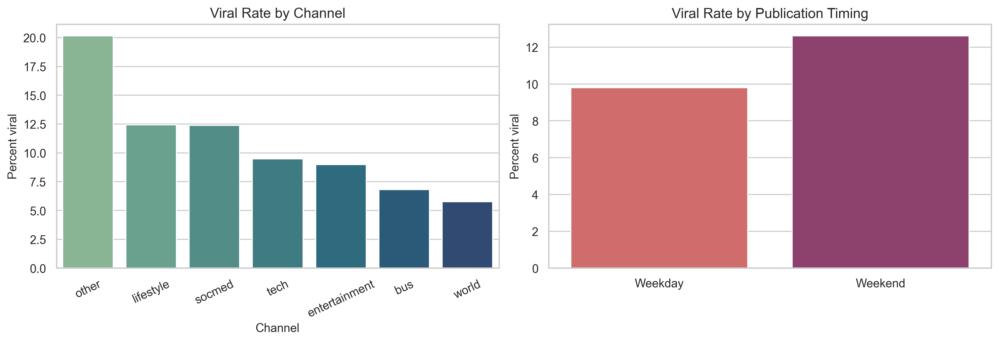
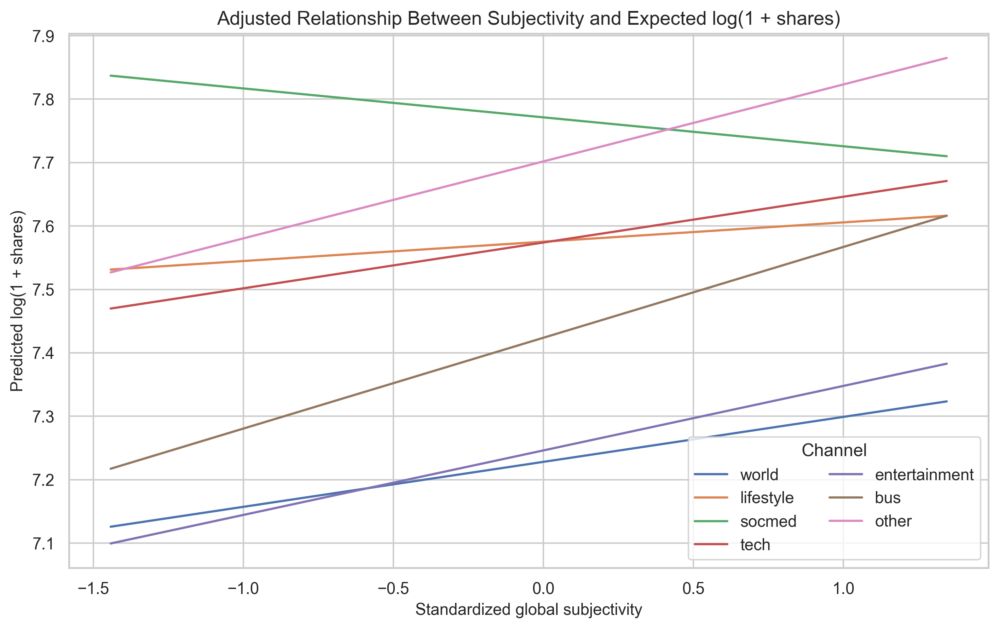

# Anatomy of a Viral Article

## Introduction and Motivation
Online news articles shape public opinion, attention, and conversation at a scale that extends beyond marketing metrics. When an article spreads widely, it can amplify political narratives, social movements, and consumer behavior. Because of that reach, it is useful to understand which article characteristics are associated with virality and whether those relationships differ across content categories. Prior work has often emphasized prediction, including information-cascade forecasting and popularity classification, but prediction accuracy alone does not show which article features have interpretable statistical associations with sharing outcomes (Cheng et al.; Fernandes, Vinagre, and Cortez). This project therefore shifts the focus from prediction to inference.

The guiding question is: which structural, temporal, and sentiment features are associated with online news virality in the Mashable Online News Popularity dataset, and do those associations vary by article category?

## Data Source and Description
The data come from the UCI Machine Learning Repository’s Online News Popularity dataset, originally assembled from Mashable articles and documented by Fernandes, Vinagre, and Cortez. The local CSV used in this project contains `39,644` articles and `61` columns, even though the UCI metadata and `.names` file report `39,797` instances. This report treats the local CSV as the analytic source of truth and notes the discrepancy explicitly.

The response variable is `shares`, the number of times an article was shared. Following the proposal, virality is also analyzed as a binary outcome: an article is labeled viral if it falls in the top 10% of observed shares. In this file, that threshold is `6,200` shares. The main predictors were chosen to match the proposal’s substantive goals: title length, article length, number of images, number of videos, weekend publication, global sentiment polarity, global subjectivity, positive-word rate, negative-word rate, and content category. Category was collapsed into a single `channel` variable from the six Mashable channel indicators, with `6,134` unlabeled rows retained as `other` rather than dropped.

Table 1 summarizes the sample and the outcome distribution.

| Table 1. Sample and outcome summary | Value |
| --- | ---: |
| Analytic sample size | 39,644 |
| Missing values | 0 |
| Viral threshold | 6,200 shares |
| Overall viral rate | 10.16% |
| Median shares, full sample | 1,400 |
| IQR shares, full sample | 946 to 2,800 |
| Median shares, non-viral | 1,300 |
| Median shares, viral | 10,700 |
| Highest viral rate by channel | `other`, 20.17% |
| Lowest viral rate by channel | `world`, 5.76% |

## Exploratory Data Analysis
The response distribution is extremely right-skewed. Raw shares have skewness `33.96`, while `log(1 + shares)` reduces skewness to `1.03`. The median article received `1,400` shares, but the 99th percentile exceeded `31,000`, indicating a long upper tail. A Kolmogorov-Smirnov test on standardized log-shares still rejected normality (`D = 0.110`, `p < 0.001`), but with nearly forty thousand observations that result is expected even for moderate visual deviations. For that reason, the log transform and the plots are more informative than the test alone.

Category and timing also mattered descriptively. The viral rate was highest for unlabeled `other` articles (`20.17%`) and lowest for `world` articles (`5.76%`). Weekend publication was more common among viral articles (`16.26%`) than non-viral articles (`12.73%`).

## Methods
Because shares were highly skewed, the proposal was refined in two ways after inspecting the data. First, viral and non-viral groups were compared with Mann-Whitney U tests for continuous predictors rather than two-sample t-tests. Second, the main linear model used `log(1 + shares)` and HC3 robust standard errors because a Breusch-Pagan test showed strong heteroskedasticity (`p < 0.001`). These refinements preserve the proposal’s inferential goals while making the analysis better aligned with the observed data.

Two families of models were fit. The continuous-outcome model regressed `log(1 + shares)` on standardized structural and sentiment predictors plus weekend publication and article channel, using `world` as the reference category. The binary-outcome model used logistic regression for the top-10% virality indicator with the same predictors and reported odds ratios. To test the proposal’s claim that sentiment effects differ by category, an interaction model added channel-by-subjectivity and channel-by-sentiment-polarity terms and was compared to the base model with a nested-model F test. Model diagnostics included variance inflation factors, residual plots, a Breusch-Pagan test, McFadden pseudo-\(R^2\), ROC AUC, and a robustness check that refit the OLS model after excluding the top 1% of shares.

## Results
Univariate comparisons showed that viral articles tended to have more images, more videos, slightly higher subjectivity, and a higher weekend publication rate. Channel had the strongest bivariate relationship with virality in the univariate tests (Cramer's `V = 0.156`, FDR-adjusted `q < 0.001`). Subjectivity also stood out among continuous predictors (rank-biserial `r = 0.153`, `q < 0.001`). In contrast, title length, negative-word rate, and overall sentiment polarity were not significant after false-discovery-rate correction.

| Table 2. Univariate comparisons of viral vs. non-viral articles | Effect size | FDR-adjusted q-value |
| --- | ---: | ---: |
| Channel | 0.156 (Cramer's V) | <0.001 |
| Global subjectivity | 0.153 (rank-biserial r) | <0.001 |
| Number of videos | 0.112 (rank-biserial r) | <0.001 |
| Number of images | 0.073 (rank-biserial r) | <0.001 |
| Weekend publication | 0.031 (Cramer's V) | <0.001 |
| Article length | -0.059 (rank-biserial r) | <0.001 |
| Positive-word rate | -0.031 (rank-biserial r) | 0.002 |
| Sentiment polarity | 0.015 (rank-biserial r) | 0.150 |
| Negative-word rate | -0.007 (rank-biserial r) | 0.496 |
| Title length | -0.004 (rank-biserial r) | 0.650 |

In the multivariable models, structural and timing variables remained important even after adjustment. In the HC3-robust OLS model, one standard-deviation increases in image count, content length, video count, and subjectivity were associated with higher expected log-shares, while weekend publication was associated with the largest single shift among the proposal’s non-category predictors (`beta = 0.284`, about a `32.9%` increase in expected shares holding other variables fixed). Positive-word rate and negative-word rate were both negative in the adjusted OLS model, suggesting that once broader subjectivity and polarity were controlled, articles with a more extreme balance of sentiment words did not systematically receive more shares.

The logistic model told a similar story. A one standard-deviation increase in image count raised the odds of being viral by about `11.2%` (`OR = 1.112`, `95% CI [1.078, 1.148]`), and a one standard-deviation increase in subjectivity raised the odds by about `25.4%` (`OR = 1.254`, `95% CI [1.195, 1.316]`). Weekend publication was also associated with higher odds of virality (`OR = 1.233`, `95% CI [1.126, 1.351]`). Content length was significant in the OLS model but not in the logistic model, which suggests it is more related to incremental increases in shares than to crossing the top-decile cutoff itself.

| Table 3. Main multivariable results | OLS beta on log-shares | Logistic odds ratio |
| --- | ---: | ---: |
| Title length | 0.009 (`p = 0.049`) | 1.038 (`p = 0.031`) |
| Content length | 0.031 (`p < 0.001`) | 1.013 (`p = 0.499`) |
| Number of images | 0.046 (`p < 0.001`) | 1.112 (`p < 0.001`) |
| Number of videos | 0.019 (`p < 0.001`) | 1.057 (`p < 0.001`) |
| Weekend publication | 0.284 (`p < 0.001`) | 1.233 (`p < 0.001`) |
| Sentiment polarity | -0.020 (`p = 0.013`) | 0.985 (`p = 0.576`) |
| Subjectivity | 0.090 (`p < 0.001`) | 1.254 (`p < 0.001`) |
| Positive-word rate | -0.083 (`p < 0.001`) | 0.788 (`p < 0.001`) |
| Negative-word rate | -0.088 (`p < 0.001`) | 0.847 (`p < 0.001`) |

Category differences were substantial. Relative to `world`, lifestyle, social media, tech, business, entertainment, and especially `other` articles all showed higher adjusted popularity. In the logistic model, `other` articles had the highest odds of virality (`OR = 3.134`, `95% CI [2.766, 3.550]`), followed by social media (`OR = 2.174`) and lifestyle (`OR = 2.078`). The interaction test was also highly significant (`F = 13.24`, `p < 0.001`), supporting the proposal’s expectation that sentiment-related associations differ across categories. Figure 3 shows that subjectivity had a clearly positive adjusted association in most channels, but the slope was weakest and slightly negative for social media articles.

Model fit was moderate rather than strong. The main OLS model had `R^2 = 0.076`, the logistic model had McFadden pseudo-`R^2 = 0.041`, and the ROC AUC was `0.655`. Those values reinforce the project’s central point: virality is not explained by a single easy recipe, even when several features are statistically significant. The robustness check excluding the top 1% of share counts did not reverse the direction of the main structural or timing coefficients.

## Relation to the Original Proposal
This final project remains closely aligned with the proposal. The core research question, top-10% virality definition, use of structural, temporal, and sentiment predictors, and emphasis on interpretable regression all stayed the same. The main changes were methodological refinements made after seeing the data: Mann-Whitney tests replaced parametric mean-comparison tests because the distributions were heavily skewed, and HC3 robust standard errors were used because residual variance was not constant. Those changes strengthened the proposal rather than changing its direction.

## Limitations
Several limitations matter for interpretation. First, the dataset comes from one publisher and an older publishing environment, so the findings may not generalize cleanly to current platforms or to outlets with different audiences. Second, virality is measured only through share counts and does not observe network structure, headline placement, recommender systems, or external events, all of which can affect diffusion. Third, the `other` category is large and heterogeneous, making it hard to interpret substantively even though it is statistically important. Finally, this is an observational study, so the results should be read as associations rather than causal effects.

## Conclusion
The analysis suggests that online news virality in this dataset is associated less with a single sentiment formula and more with a combination of format, timing, and topic context. Articles with more images and videos, higher subjectivity, and weekend publication tended to perform better, while category differences were large and persistent across models. At the same time, the relatively low fit statistics show that these variables explain only a limited share of overall popularity. That conclusion is still informative: virality is context-dependent, only partly captured by article-level features, and likely shaped by omitted social and platform dynamics.

## Works Cited
Bandari, Roja, Sitaram Asur, and Bernardo A. Huberman. "The Pulse of News in Social Media: Forecasting Popularity." *Proceedings of the International AAAI Conference on Web and Social Media*, vol. 6, no. 1, 2012, pp. 26-33.

Cheng, Justin, et al. "Can Cascades Be Predicted?" *Proceedings of the 23rd International Conference on World Wide Web*, 2014, pp. 925-936.

Fernandes, Kelwin, Pedro Vinagre, and Pedro Cortez. "A Proactive Intelligent Decision Support System for Predicting the Popularity of Online News." *Proceedings of the 17th EPIA Conference on Artificial Intelligence*, 2015, pp. 535-546.

"Online News Popularity." *UCI Machine Learning Repository*, University of California, Irvine, https://archive.ics.uci.edu/dataset/332/online+news+popularity. Accessed 3 Mar. 2026.
